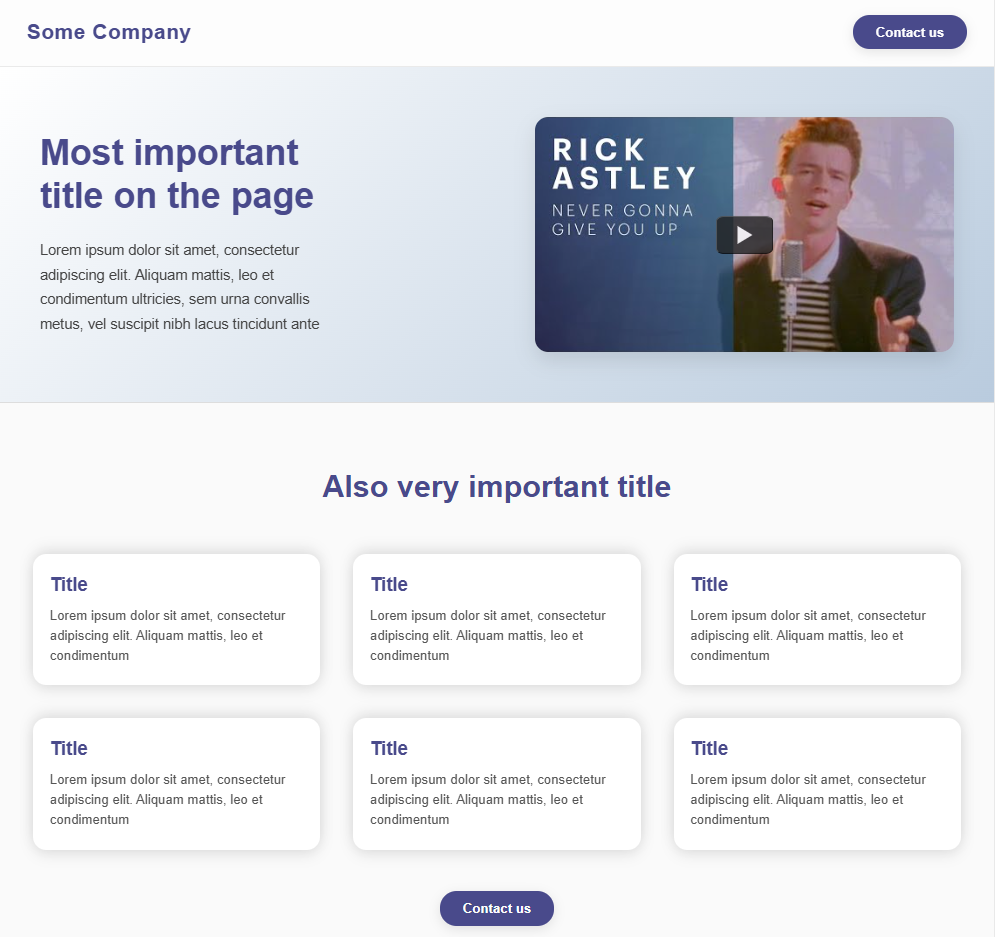

# Some Company – Лендинг и форма обратной связи

Современный адаптивный лендинг с формой обратной связи, разработанный с использованием **Next.js**, **TypeScript**, **Material UI** и **styled-components**. Оптимизирован по требованиям SEO, доступности и производительности.

Демо: [http://84.201.151.82/](http://84.201.151.82/)

---

## Технологии

- **Фреймворк**: [Next.js](https://nextjs.org/)
- **Язык**: TypeScript
- **UI-библиотека**: [Material UI (MUI)](https://mui.com/)
- **Стилизация**: styled-components (CSS-in-JS)
- **Формы**: react-hook-form + yup
- **Управление Head и мета-тегами**: next/head
- **Видео**: react-lite-youtube-embed
- **Сервер**: Yandex Cloud VM + Nginx + systemd

---

## Быстрый старт

### Требования
- Node.js 18+
- npm или yarn

### Установка

```bash
npm install

```

###  Запуск в режиме разработки

```bash
npm run dev
```

Приложение будет доступно по адресу [http://localhost:3000](http://localhost:3000).

---

##  Особенности стилизации

Используется `styled-components` — современный способ написания CSS прямо в компонентах.

Основные моменты:
- Полностью адаптивная вёрстка
- Анимации появления (`fadeIn`, `fadeSlideIn`)
- Кастомные стили для состояний `:hover`, `:focus`
- Переходы и тени при наведении (для карточек и кнопок)

###  Необычные/современные приёмы CSS

- Облегчённая загрузка YouTube-видео с помощью **react-lite-youtube-embed** — iframe загружается только при взаимодействии. Это значительно улучшает **Core Web Vitals** (особенно LCP и FID).
- Кнопки и карточки используют **скейл-эффекты при наведении и нажатии**, увеличивая интерактивность без ущерба для доступности.

---

##  SEO и производительность

Следуем лучшим практикам SEO:
- На каждой странице задаётся уникальный <title> и <meta name="description">, описывающий содержимое страницы.
- Канонические ссылки (`<link rel="canonical" />`)
- Правильная иерархия заголовков (`h1`, `h2`, `h3`)
- Мета-теги `robots`, `viewport`, `charset`
- Поддержка мета-тегов для соцсетей

---

##  Доступность 

- Семантическая HTML-структура (`<section>`, `<article>`, `<form>`, `<header>`, `<footer>`)
- Метки и `aria`-совместимые ошибки валидации форм
- Навигация с клавиатуры
- Видимый фокус и высокая контрастность элементов

---

##  Что реализовано

-  Типизированный код (TypeScript)
-  Адаптивная вёрстка
-  Валидация форм в реальном времени
-  Анимации и интерактивные состояния
-  SEO и доступность на каждой странице
-  Высокая производительность (легкие компоненты, lazy load)

---

## Автор

Разработано pkmal.

---